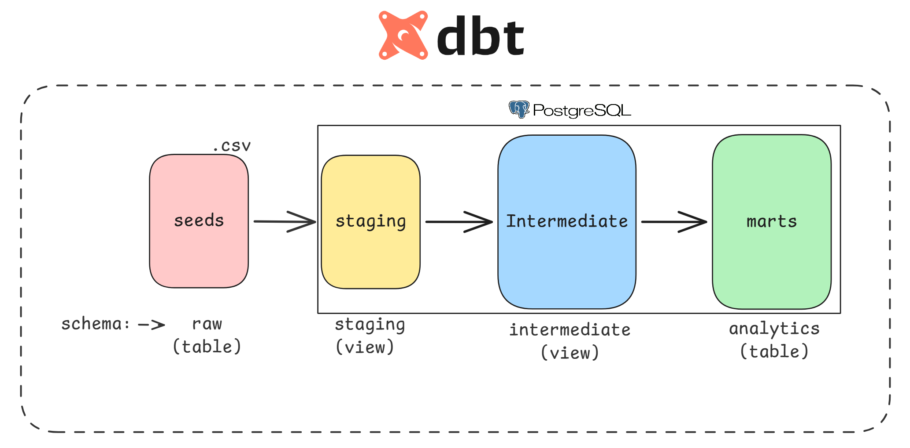
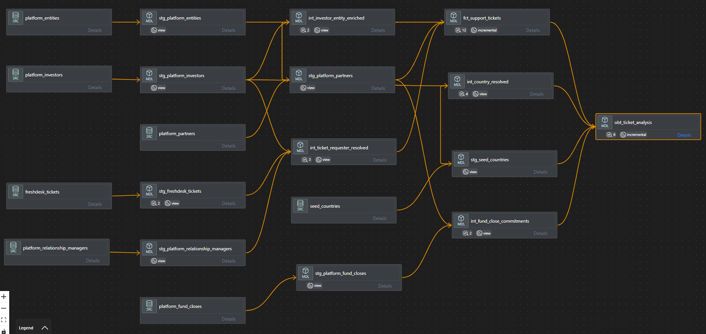
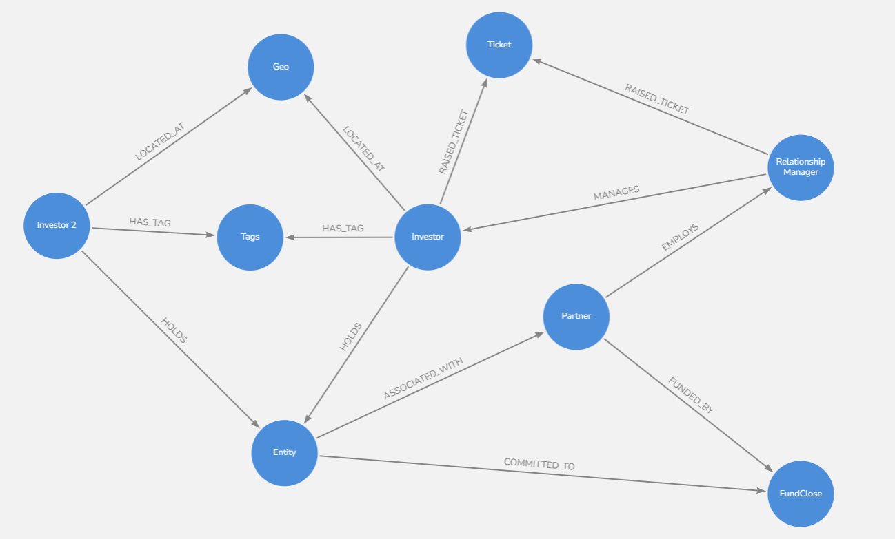
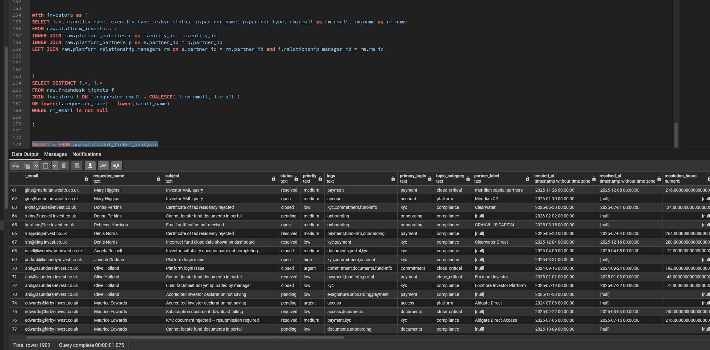

# Titanbay Investor Support Intelligence Platform

> An analytics data warehouse for a Private Equity investment platform, transforming fragmented operational data into a unified intelligence layer that connects every support interaction to a known investor, entity, partner, geography, and fund close.

---

## The Business Problem

Titanbay operates a PE investment platform where **wealth managers, fund managers, and family offices** distribute fund access to their end investors. The Investor Services (IS) team handles ~2,000 support tickets annually across 14 partner organisations, 800+ investors, and 150+ fund closes spanning multiple geographies.

Before this project, the data lived in disconnected silos:

| System | What it knows | What it doesn't know |
|--------|--------------|---------------------|
| **Freshdesk** | Who emailed, what they asked, how long it took | Whether the requester is an investor or an RM, which partner they belong to |
| **Platform DB** | Investor profiles, entity structures, fund commitments | How often each investor contacts support, what they ask about |
| **Seed CSVs** | Country ISO codes, timezone offsets | Which investors map to which countries (free-text field, inconsistent) |

The result: the IS team could tell you *how many tickets were open*, but not *which partners drive the most support load*, *whether ticket volume spikes around fund closes*, or *whether European investors are being served within their business hours*.

---

## Running the Project (PostgresSQL server (As it's free))

### Clone the repo


```
git clone https://github.com/denironyx/titanbay.git

cd ..
```
Todo:
- Create a virtual environment for python dependencies management
- Specify your host, dbname, password and username within the `profiles.yml` file


```bash

uv pip install dbt-postgres or pip install dbt-postgres
dbt deps
dbt seed
dbt run
dbt test
dbt docs generate && dbt docs serve
```

To implement in bigquery, I added this [RUNBOOK](RUNBOOK.md)

## What This Project Delivers

### 1. Identity Resolution — Who is actually asking?

Every Freshdesk ticket arrives as an email address and a name. This project resolves that identity through a **waterfall matching strategy**:

```
Ticket requester email
  ├─ Match against platform_investors.email  → investor (+ entity + partner chain)
  ├─ Match against platform_rms.email        → RM identified → partner attribution
  └─ No match                               → unresolved (flagged for data quality)
```

The output is **investor-centric**. The RM is not a separate analytical entity — they are a property of the investor relationship. Every investor record carries a `has_relationship_manager` flag indicating whether an RM is assigned. When an RM raises a ticket on behalf of an investor, the ticket is attributed to the RM's partner (for workload and SLA analysis), but `investor_key` remains null because each RM manages 20-35 investors and we cannot determine which one without additional signal (subject line parsing, name matching). This is a documented candidate for probabilistic resolution.

This turns an anonymous support queue into an **attributed interaction log** — every ticket is linked to a partner, an entity type, a geography, and (where applicable) a nearby fund close event.

### 1b. Topic Classification; What is the ticket about?

Each ticket carries comma-separated tags (e.g., `"kyc,commitment"`). The model derives two columns using a **priority based CASE WHEN** — no additional seed data:

| Priority | Tag | Category | Business meaning |
|----------|-----|----------|-----------------|
| 1 | kyc | `compliance` | Can block a close — regulatory gate |
| 2 | commitment | `close_critical` | Capital calls and close execution |
| 3 | payment | `close_critical` | Money movement |
| 4 | e-signature | `close_critical` | Signing during close |
| 5 | documents | `close_critical` | Close-related paperwork |
| 6 | onboarding | `compliance` | New investor friction |
| 7 | fund-info | `pre_investment` | Research phase |
| 8-10 | portal, access, account | `platform` | Technical friction |

When a ticket has multiple tags, the **highest-priority tag wins**. So `"kyc,commitment"` becomes `primary_topic = 'kyc'`, `topic_category = 'compliance'` — because KYC can block the close entirely, making it the more urgent signal.

This enables analysts to answer: *"Do close-critical tickets spike near fund close dates?"* and *"Which partners generate the most compliance friction?"*

### 2. Geographic Intelligence — Why location matters in PE

> To enable geospatial intelligence, I needed to source data from restcountries.com using my R library https://github.com/denironyx/tidycountries.

Investor location is not a nice to have in Private Equity. It determines:

- **Regulatory jurisdiction**: KYC requirements, eligible fund structures, and reporting obligations vary by country. A trust domiciled in the Cayman Islands has different compliance needs than a pension fund in Switzerland.

- **Tax treaty eligibility**: Withholding rates on fund distributions depend on bilateral treaties between the fund jurisdiction and the investor's country of residence.

- **Timezone-aware SLA measurement**: A ticket submitted at 09:00 SGT and resolved at 17:00 GMT looks like an 8-hour resolution. But from the investor's perspective, they waited a full business day. Knowing the investor's UTC offset transforms resolution metrics from *wall-clock hours* into *experienced service quality*.

- **Regional fundraising strategy**: "What share of committed capital originates from Asia-Pacific?" is a board-level question. Without standardised geography, the answer requires manual spreadsheet reconciliation.

- **Market penetration analysis**: Comparing investor density against addressable wealth by country reveals where the platform is under penetrated.

The challenge: the `country` field in `platform_investors` is free text. Investors type "Korea", "Macao", "Sao Tome and Principe" "Slovakia (Slovak Republic)", or "Libyan Arab Jamahiriya" — none of which match the reference dataset exactly.

This project resolves **100% of country names** through a three-step waterfall — all self-contained in SQL, no additional seed files:

| Step | Method | Example |
|------|--------|---------|
| 1 | Exact match on common name | "Germany" → DEU |
| 2 | Exact match on official name | "Kyrgyz Republic" → KGZ |
| 3 | Inline CASE WHEN fallback | "Slovakia (Slovak Republic)" → SVK, "Sao Tome" → STP, "Korea" → KOR |

Every resolution carries a `match_method` audit trail so the data team can monitor quality. The fallback CASE WHEN covers 40+ alias/variant mappings inline — no external seed dependency, making the model fully self-contained and portable.

### 3. Partner Attribution — Following the money

A ticket's partner isn't always obvious. The `partner_label` field is free-text and inconsistent ("Ashford Wealth Management" vs "Ashford WM" vs "ashford wealth"). This project resolves partner through a **three-path fallback**:

```
1. Investor → Entity → Partner     (structural FK chain, covers majority of resolved tickets)
2. Fuzzy label match               (contains, prefix, case-insensitive — fallback for unresolved)
```

The result: partner-level analytics even when the label field is messy.

### 4. Fund Close Correlation — Connecting support to revenue events

Fund closes are the core revenue events in PE distribution. Each close represents a tranche of investor capital locked into a fund. The OBT layer pre-joins the nearest fund close (within +/- 30 days) to every ticket, enabling analysts to answer:

- *Do support tickets spike in the week before a close deadline?*
- *Are high-priority tickets concentrated around larger closes?*
- *Which partners see the most close-adjacent support activity?*

This turns reactive support reporting into proactive operational intelligence.

---

## Architecture

The architecture follows standard dbt practice: **seed -> staging -> intermediate -> marts** where marts are analytical output tables, not a re-implemented star schema.




### Layer structure:

```
models/
├── staging/          ← Source-conformed views. No business logic.
│   ├── freshdesk/        1 model  + 1 source YAML
│   ├── platform/         5 models + 1 source YAML
│   └── reference/        2 models + 1 source YAML
├── intermediate/     ← Business logic. Resolution, enrichment, waterfall matching.
│   └── 4 models + 1 schema YAML
└── marts/            ← Analyst-facing. facts.
    ├── facts/            1 model (incremental)
    └── obt/              1 model (incremental)
```

 
_Visualize using vscode-dbt-power-user extension plugin_

**Why this structure:**

- **Staging is boring by design.** Trim, lowercase, null handling. If you see business logic in staging, something is wrong. This makes staging models reusable — multiple intermediate models can consume the same staging model without inheriting each other's logic.
- **Intermediate does the hard thinking.** Entity resolution, country resolution, and entity enrichment all live here. These are views (not tables) because they don't need to be persisted — they're consumed by the marts layer, which materialises the result.
- **Marts speak the analyst's language.** descriptive column names (`investor_name` not `full_name`). The OBT goes one step further: zero joins required, every column an analyst might filter or group by is pre-joined.


No separate dimension tables, the source data is already normalised with stable UUID primary keys. Adding surrogate keys on top would re-create what already exists without adding value. The intermediate layer does the genuine work (identity resolution, country standardisation) and the marts layer produces the analytical output.


### Incremental strategy

Both `fct_support_tickets` and `obt_ticket_analysis` use a `delete+insert` strategy
partitioned by `var('run_date')`:

```bash
# Daily load — process only today's tickets (fast, idempotent)
dbt run --select fct_support_tickets obt_ticket_analysis --vars '{"run_date": "2025-06-15"}'

# Backfill a specific date
dbt run --select fct_support_tickets obt_ticket_analysis --vars '{"run_date": "2025-03-01"}'

# Full refresh — recompute everything (needed periodically for window functions)
dbt run --select fct_support_tickets obt_ticket_analysis --full-refresh
```

---

## Data Quality Framework

### Tests

**Where to look:** `tests/`, `_intermediate_models.yml`, `_marts_models.yml`

Five custom tests enforce data integrity beyond standard schema tests:

| Test | What it catches | Remediation |
|------|----------------|-------------|
| `assert_country_resolution_coverage` | Any investor country that couldn't be resolved to an ISO code | Add the name using a CASE WHEN statement |
| `assert_entity_resolution_coverage` | Ticket identity resolution dropping below 90% | Investigate upstream email data quality |
| `assert_fct_ticket_grain` | Row count mismatch between fact and staging (grain explosion or lost rows) | Check join logic in fact model |
| `assert_obt_grain_matches_fact` | OBT row count diverging from fact (dimension fan-out) | Check dimension join cardinality |
| `assert_no_future_ticket_dates` | Tickets where `resolved_at < created_at` | Flag data entry error upstream |

The country resolution test is particularly important: it **fails the build** if any country name is unresolved, forcing the team to curate the alias seed before deploying. This is a deliberate design choice, silent data loss in geography is worse than a failed build.

**Schema level Unit tests (in YAML):** `unique`, `not_null`, `accepted_values`, `relationships` (FK integrity), and `dbt_expectations` tests for value ranges (resolution_hours 0-8760, timezone offset -12 to +14, local hour 0-23), string lengths (ISO alpha-2 = 2, alpha-3 = 3), and value sets (priority, status, entity_type).

---

## Business Questions Now Answerable

### Investor Behaviour
- Which investors are repeat support requesters? (lifetime ticket count, is_repeat flag)
- What is the typical ticket trajectory for a new investor? (ticket rank per investor)
- Do investors from specific regions raise more tickets? (geography + ticket count)

### Partner Performance
- Which partners drive the most support demand per investor? (normalised ticket rate)
- How does resolution time vary across partners? (avg resolution_hours by partner)
- Are certain partner types (wealth manager vs family office) systematically different?

### Operational Efficiency
- What are our actual SLAs in the investor's local timezone? (local hour + resolution hours)
- When do investors contact us in their local time? (ticket_created_local_hour distribution)
- Should we staff support differently for APAC vs EMEA hours?

### Fund Close Intelligence
- Does support volume spike before fund close deadlines? (days_to_close histogram)
- Are high-priority tickets correlated with larger closes? (priority + close_committed_aum)
- Which closes are operationally "expensive"? (ticket count within +/- 30 days of close)

### Geographic Strategy
- What share of committed capital originates from each region? (AUM by investor geography)
- Where is the platform under-penetrated relative to addressable market?
- Do KYC-related tickets cluster in specific jurisdictions? (tags + geography)

---

## Assumptions

### Data compliance and governance

This model consumes data from Titanbay's in-house data warehouse and Freshdesk instance.

We assume that **data collection and storage are already compliant** with applicable regulations (GDPR for EU investors, data protection regimes in other jurisdictions).
Specifically:

- Investor PII (email, name, country) is sourced from the platform's own database — Titanbay is the data controller and has a lawful basis for processing.
- Freshdesk is a data processor operating under Titanbay's data processing agreement.
- The analytics warehouse inherits the same access controls and retention policies as the source systems.

In a production deployment, this assumption would need to be validated with the compliance team. The model does not introduce cross-border data transfers beyond what the source systems already perform. If the warehouse were hosted in a different jurisdiction from the source data, additional safeguards (Standard Contractual Clauses, adequacy decisions) would apply.

This is out of scope for this submission but worth flagging: **geography aware analytics increases the surface area for regulatory scrutiny**, if we segment investors by country and use that for commercial decisions (fundraising targeting, SLA differentiation), the compliance team should review whether this constitutes profiling.

### Ticket lifecycle — snapshot vs history

The Freshdesk data as provided represents **the latest state of each ticket**, one row per `ticket_id` with the current `status` and timestamps (`created_at`, `resolved_at`). This is a snapshot, not a history.

In reality, tickets transition through a lifecycle:

```
open → pending → resolved → closed
  ↑       │          │
  └───────┘          │    (reopened)
  ↑                  │
  └──────────────────┘
```

The current model captures only the endpoints (`created_at`, `resolved_at`) and the current status. It cannot answer:

- *How long was the ticket in "pending" before an agent picked it up?* (first response time)
- *Was the ticket reopened after resolution?* (reopen rate)
- *How many status transitions did the ticket go through?* (handling complexity)

**What the ideal source would provide:** A `ticket_status_history` table with one row per status change (`ticket_id`, `status`, `changed_at`, `changed_by`). This would enable:

1. **A history/audit table** (`fct_ticket_status_changes`) — one row per transition,
   enabling funnel analysis and dwell-time metrics per status.
2. **A current-state table** (`fct_support_tickets`, as built) — one row per ticket
   with the latest status, optimised for reporting.
3. **SCD Type 2 on ticket status** — if we need to know what a ticket's status was at any historical point in time.

The current model is built for the data we have: latest-state snapshots. The incremental `delete+insert` strategy is compatible with both — if the source evolves to provide status history, the fact table continues to serve current-state reporting while a new history model captures the transitions. No existing models would need to change.

### Source data is already dimensional; no star schema needed

The platform database stores investors, entities, partners, and RMs as separate tables with UUID primary keys and clean foreign key relationships. This is already a normalised dimensional structure. Building `dim_investors`, `dim_entities`, `dim_partners` with surrogate keys on top would re-create what already exists without adding value:

- UUIDs are globally unique and stable — no collision risk
- Single source system — no multi-source key reconciliation needed
- No slowly changing dimension requirement — the data is snapshot-based
- The intermediate layer adds the genuine value (entity resolution, country
  standardisation, investor-entity-partner enrichment)

### Self contained SQL: no external seed dependencies for mappings

Country name aliases and ticket topic classifications are implemented as inline CASE WHEN
statements rather than separate seed files. This makes the model:
- Fully portable — clone the repo and run, no seed data to manage
- Easier to review — all mapping logic is visible in the SQL
- Easier to extend — add a new CASE WHEN line vs editing a CSV and re-seeding

The `seed_countries.csv` reference table (250 ISO countries) is the only seed needed for
country resolution — it provides the target reference data, not the mapping logic.

### Unresolved tickets — kept in fact, excluded from OBT

~98 tickets (~5%) cannot be resolved to a known investor. These are all from Titanbay IS staff emails (@titanbay.com, @titanbay.co.uk) where the `requester_name` does not match any investor in the platform.

These tickets are **kept in `fct_support_tickets`** with `requester_type = 'unresolved'` because:
- The fact table is the system of record — dropping rows silently is an anti-pattern
- Total ticket volume counts should match the source (the grain test enforces this)
- The `requester_type` flag makes them trivially filterable

They are **excluded from `obt_ticket_analysis`** (`WHERE investor_id IS NOT NULL`) because:
- The OBT is a curated analytical view for investor-centric questions
- Rows without investor, entity, or partner context add noise to every GROUP BY
- Analysts shouldn't have to remember to filter them on every query

The grain test for the OBT validates against the resolved subset of the fact table, not the full fact table.

### Other assumptions

1. **Entity resolution uses enriched investor records.** The RM is joined to the investor BEFORE matching tickets, so every resolved ticket gets an `investor_id`. When an RM raises a ticket, it resolves to the investor they manage. Resolution priority: investor email > RM email > investor name. Resolution rate: ~95%.

2. **Most recent investor wins on duplicate match.** `created_at desc` tiebreaker. 6 investor names appear twice — the tiebreaker prevents grain explosion.

3. **"Korea" means South Korea.** PE investors are from South Korea; North Korea is sanctioned.

4. **"Congo" means Republic of the Congo (COG).** DRC is typically specified explicitly.

5. **90% resolution threshold.** Current baseline is 95%. A drop below 90% signals an upstream data quality problem.

6. **Window functions in OBT are partition-scoped.** `lifetime_ticket_count` and  `ticket_rank_for_investor` compute within the incremental partition only. Periodic `--full-refresh` recomputes across all data.

---

## Design Decisions

| Decision | Rationale |
|----------|-----------|
| **No star schema / no surrogate keys** | Source data is already normalised with stable UUIDs. Surrogate keys and dimension wrappers add complexity without value. The intermediate layer does the real work. |
| **Inline CASE WHEN** over seed files for mappings | Country aliases (40+ variants) and topic classification (10 tags) are self-contained in SQL. No seed management overhead, fully portable, all logic visible in one place. |
| **Enriched investor for entity resolution** over separate RM matching | Join RM to investor first, then match tickets. Every resolved ticket gets an investor_id. No separate "RM-type" tickets with null investor context. |
| **Fuzzy partner label matching** as fallback | Partner labels are free-text. Structural FK chain (investor → entity → partner) covers 95% of tickets; fuzzy match handles the rest. |
| **OBT for self-service** | Analysts work in Excel or lightweight BI tools. A pre-joined table eliminates SQL joins. The fact table remains for power users who need flexibility. |
| **Incremental delete+insert** over merge | Tickets update (status, resolved_at). Delete+insert is idempotent without merge edge cases. |
| **Geospatial data integration** | Geographic data quality and integration is non-negotiable for regulatory and strategy use cases. |
| **Latest-state fact table** over SCD history | Source provides snapshots, not status transitions. Model upgrades gracefully if the source evolves. |


## AI Tool Usage

Claude (via Claude Code CLI) was used as a collaborative partner throughout:
- **Data exploration**: profiling source data, identifying entity resolution challenges, country name mismatches.
- **Implementation**: generating tests, code reviews and edge case implementation.
- **Documentation**: structuring all docs with consistent references, proofreading, improving documentations and continous updates.


## What's Next (Recommendation)

### Near-term enhancements
- **SLA targets by region** — Define and enforce response time thresholds (e.g., 4-hour first response for APAC during 09:00-18:00 local) and expose SLA breach rates in the OBT.
- **Ticket topic classification** — Parse the `tags` field into a conformed dimension and build a topic-by-partner heatmap to surface systemic issues (e.g., "partner X has 3x the KYC ticket rate").
- **RM workload balancing** — Surface which RMs are over/under-allocated relative to their investor count and ticket volume.
- **Ticket status history model** — If the source evolves to provide status change events, add `fct_ticket_status_changes` for dwell-time analysis (time in pending, reopen rate, handling complexity) alongside the current latest-state fact table.

### Production readiness
- **Source migration** — Replace CSV seeds with live connectors (Freshdesk API, platform database replication) via Fivetran or Airbyte.
- **Orchestration** — dbt Cloud or Airflow DAG with daily `run_date` variable injection.
- **Monitoring** — dbt exposures linking to Looker/Metabase dashboards; Elementary or re_data for anomaly detection on resolution rates and ticket volume.

---

## Evolving Entity Resolution — From Deterministic to Probabilistic

> Probabilistic identity resolution is an active area of interest of mine and it's getting better with llm https://denniseirorere.com/posts/identity-is-an-inference-problem/ 

The current identity resolution is **deterministic**: exact email match, waterfall order, done. It works well for structured identifiers like email, but it breaks down when:

- An investor uses a personal email for Freshdesk and a corporate email on the platform
- A name appears with slight variation ("Jean-Pierre Muller" vs "Jean Pierre Mueller")
- An RM submits a ticket on behalf of an investor using their own email
- A new investor contacts support *before* their platform profile is created

### Where probabilistic resolution takes this

A probabilistic approach treats identity as a **confidence score** rather than a binary match. Instead of asking "is this the same person?" it asks "how likely is it that these two records refer to the same entity, given all available signals?"

**Candidate signals for scoring:**

| Signal | Weight | Why |
|--------|--------|-----|
| Email exact match | Very high | Current approach — nearly definitive |
| Email domain match | Medium | `j.mueller@acme.com` and `jean.mueller@acme.com` share a rare corporate domain |
| Name similarity (Jaro-Winkler / Levenshtein) | Medium | Catches typos, transliterations, accent stripping |
| Partner label vs investor's partner | High | If the ticket mentions "Ashford" and the candidate investor belongs to Ashford, that's strong corroboration |
| Ticket history co-occurrence | Low-Medium | If two email addresses always appear in tickets about the same entity, they may be the same person |
| Temporal proximity | Low | A ticket created 2 minutes after an investor's platform signup is likely that investor |


**Why this matters for PE:** A 5% improvement in resolution rate means ~100 more tickets attributed to known investors — more data points for partner SLA reporting, investor health scoring, and fund close correlation.

---

## Graph Analytics

PE is fundamentally a network business, investors connect to entities, entities to partners, partners to funds, funds to closes, and support interactions cut across all.


_A diagram of a rough chart of a graph modeling exercise._

### Co-investment network analysis

- **Investor clusters** — Groups who repeatedly co-invest. Often correspond to informal networks (same RM, geography, or partner).
- **Influence nodes** — Investors or RMs at the centre of multiple clusters.
- **Contagion risk** — If a key investor withdraws, who else is likely to hear about it?

### Knowledge graph

Graph queries that are awkward in SQL become natural:
- *"Investors within 2 hops of a partner with KYC failure rate > 10%"*
- *"RMs managing investors with tickets in the 7 days before their fund close"*
- *"Communities of investors with similar support patterns"* (Louvain, Label Propagation)

---

## Alerting and Observability

### Tiered notification

```
  P1 (Page)  → PagerDuty    — pipeline broken, SLA breach
  P2 (Notify)→ Slack        — resolution drift, volume anomaly
  P3 (Log)   → Email digest — weekly quality summary, trends
```

### Tooling Options

| Tool | Role |
|------|------|
| **PagerDuty** | P1 incident escalation with on-call rotation |
| **Slack** (webhooks) | P2 team alerts in a dedicated slack channel e.g`#is-ops` |
| **Grafana** | SQL based alert rules + operational dashboards |
| **Elementary** | dbt-native data observability (zero new infra) |
| **Monte Carlo / Soda** | ML-driven anomaly detection at scale |


## Reflection

**_"Based on what you have seen in the data, what would the ideal long-term fix(es) be for the core data linkage problem(s) you encountered? What would you add or change at the source to make this model more robust?"_**

The core linkage problem is that Freshdesk and the platform share no stable foreign key. The only bridge is email address and name, which is fragile: it fails when an investor uses a different email for support, when an RM submits on someone's behalf, or when a new investor contacts support before their profile exists.

The ideal long-term fix is to **add a platform issued identifier to Freshdesk at ticket creation time**, either by embedding the investor's `user_id` or `investor_id`. This eliminates the need for email/full name based probabilistic matching entirely and makes the linkage deterministic and audit-proof.

For geography, the fix is to **replace the free-text country field with a constrained dropdown backed by the ISO 3166 reference list** at investor registration. This removes the entire country resolution, every investor would register with a valid alpha-3 code from day one.

**Standardise the `partner_label` field in Freshdesk.** Replace the free-text field with a dropdown or auto-populated field mapped to `platform_partners.partner_id`. This eliminates the "Ashford" vs "Ashford WM" vs "Ashford Wealth Management" problem entirely.


---

Final Output

